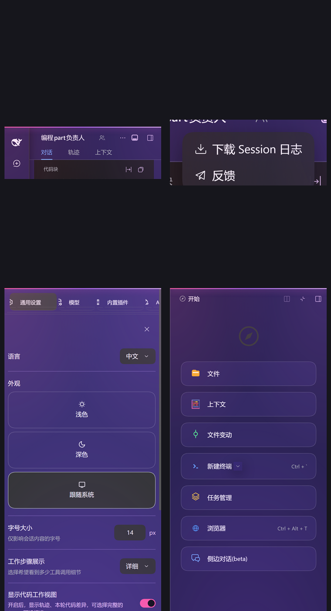
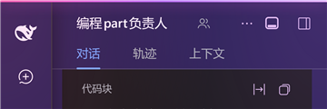
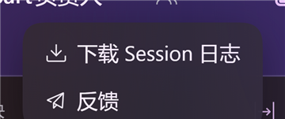
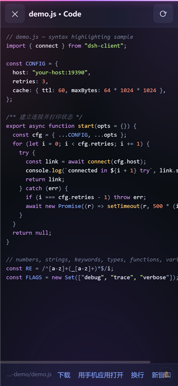
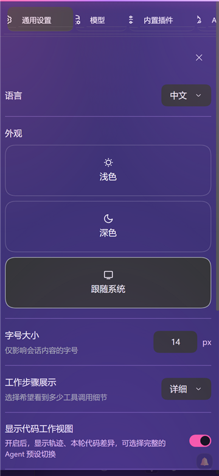
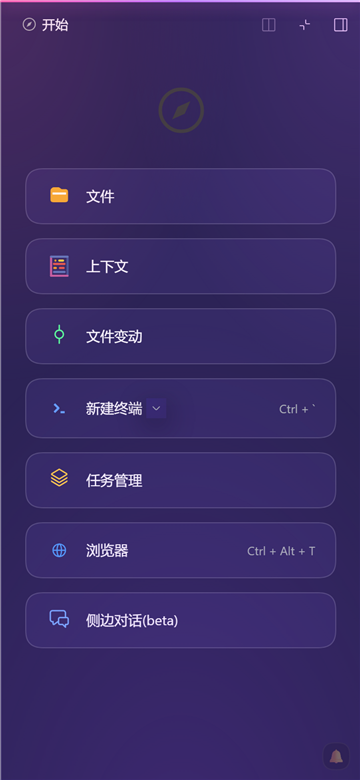
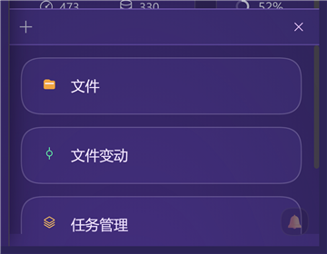
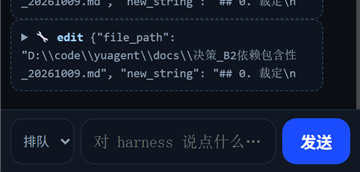

# dsh-mobile-proxy-agent

**让 DeepSeek Harness 在手机上真正可用。** 一个反向代理 + 热补丁通道：不改 DSH 本体、不重装 APK，改一个文件刷新即生效。
**Make DeepSeek Harness actually usable on a phone** — a reverse proxy plus a hot-patch channel: no DSH modification, no APK reinstall, edit one file and refresh.

[](https://github.com/yuxiaole-bili/dsh-mobile-proxy-agent/releases)
[](LICENSE)
[](#语言--language)

> **v0.2.2** · 作者 [@yuxiaole_awa](https://github.com/yuxiaole-bili) · 仓库 <https://github.com/yuxiaole-bili/dsh-mobile-proxy-agent>
> 手机端界面修复版：弹窗底色、菜单文字、右侧边栏全屏、底部面板滚动；客户端界面支持中英双语。
> 安全上做过一轮 10 轮 CTF 攻防演练（9/10 → **10/10 全拦**），见 [docs/PENTEST.md](docs/PENTEST.md)。



---

## 这是什么 · What it is

DSH 的网页端是给桌面浏览器写的。放到手机上（视口只有 360×780、移动浏览器内核偏旧）会遇到一串具体问题：按键重叠、设置页被挤成竖排、点文件被第三方 App 抢走、底部用量被省略号截断、某些覆盖层没有关闭入口……

这个仓库把这些坑一条条堵上，做法是**三层**，你可以只用其中一层或两层：

DSH's web UI is built for desktop browsers. On a phone (360×780 viewport, older mobile engine) it hits a list of concrete problems: overlapping buttons, a settings page squeezed into vertical text, file taps hijacked by third-party apps, truncated usage numbers, overlay panels with no way to close…

This repo fixes them one by one, in **three layers** — use one, two, or all three:

```
┌──────────────────────── 手机 / Phone ─────────────────────────┐
│  Android 壳（android/）· Android shell                         │
│    WebView + 预装资源 · 原生桥（录音/打开方式）· 线路双模切换      │
└───────────────────────────┬───────────────────────────────────┘
                            │ http://<host>:19390
┌───────────────────────────▼───────────────────────────────────┐
│  反向代理（proxy/）· reverse proxy（optional）                  │
│    鉴权 · 文件 API /f /d /dl · API 缓存 · 热补丁注入             │
└───────────────────────────┬───────────────────────────────────┘
                            │ 127.0.0.1:19387
┌───────────────────────────▼───────────────────────────────────┐
│  DSH 本体 + DSH 插件（plugin/，dsh-mobile-kit）                  │
└───────────────────────────────────────────────────────────────┘
```

| 你想要的 · You want | 需要哪几层 · Layers needed |
|---|---|
| 手机能打开完整版、布局不挤 · open the full UI on a phone | 代理 +（或）插件 · proxy and/or plugin |
| 点文件在应用内预览 + 语法高亮 · in-app file preview with highlighting | **代理** · proxy |
| 苹果用户免装 APK · iPhone/iPad without any APK | **代理**（浏览器直开）· proxy only |
| 手机点麦克风能出字 · working voice input on the phone | 代理 + **Android 壳** · proxy + Android shell |
| 发大图不被吞 · large uploads not dropped | **代理**（大 body 先收后转）· proxy |

## 功能 · Features

- **反向代理** · reverse proxy（`proxy/proxy.py`，默认 `0.0.0.0:19390`）：capability key 鉴权、Cookie 会话、文件 API、API 磁盘缓存、大 body 先收完再转发
- **热补丁通道** · hot-patch channel（`proxy/hotpatch/`）：按请求实时读取 CSS/JS 并注入页面，**改文件刷新即生效**（每个文件独立 IIFE + try/catch，坏一个不影响其它）
- **手机端交互层** · mobile UI layer：消除按键重叠、底部用量折叠按钮、长按展开、上下滑手势、覆盖层通用关闭 ✕、设置页/右侧边栏整屏化
- **文件预览 + 自写语法高亮** · in-app preview with a self-contained highlighter（图片 / PDF / 代码），点文件不再被第三方 App 抢走
- **轻量版 `/m`** · lite version：只做"发消息 + 收消息"，弱网首选
- **中英双语界面** · bilingual UI：跟随 DSH 语言，也可 `?lang=en` / `?lang=zh` 强制
- **DSH 插件形态** · as a DSH plugin（`plugin/`，`dsh-mobile-kit`）：`dsh.bundle.patch` + 客户端半，可单独使用
- **不挑客户端** · any client：Android WebView 壳、iOS Safari、桌面浏览器

## 界面 · Screenshots

| 标题栏（不再重叠）<br>header, no overlap | “…”菜单（实心可读）<br>menu, opaque | 文件预览 + 语法高亮<br>preview & highlighting |
|---|---|---|
|  |  |  |

| 设置页（整屏）<br>settings (full screen) | 右侧边栏（整屏）<br>right sidebar (full screen) | 底部面板（可滚动）<br>bottom panel (scrollable) |
|---|---|---|
|  |  |  |

| 轻量版 `/m`<br>lite version | Android 壳启动页<br>Android shell |
|---|---|
|  |  |

> 截图取自实机/无头浏览器模拟（360×780），**不含任何会话内容与服务器地址**。
> Captured on device / headless at 360×780, **with no session content or server addresses**.

## 快速开始 · Quick start

```bash
# 1) 在装有 DSH 的电脑上起代理 · run the proxy on the DSH machine
python proxy/proxy.py
#    默认监听 0.0.0.0:19390，上游 127.0.0.1:19387
#    listening on 0.0.0.0:19390, upstream 127.0.0.1:19387

# 2) 手机打开 · open on the phone
#    完整版 full:  http://<PC-IP>:19390/?k=<cap.key>
#    轻量版 lite:  http://<PC-IP>:19390/m

# 3) 体检 · health check
pwsh -File tools/healthcheck_mobile.ps1
```

**苹果用户 / iPhone · iPad**：浏览器直接打开完整版链接 → 分享 → “添加到主屏幕”即可当 App 用，**不需要 APK**。详见 [docs/USE-IOS.md](docs/USE-IOS.md)。

**挂成 DSH 插件 / mount as a DSH plugin**（可选 · optional）：

```yaml
# profile 的 cordis.patch.yml · in the profile's cordis.patch.yml
- insert:
    - id: mobile-kit
      name: 'dsh-mobile-kit'          # 或绝对路径 · or an absolute path
```

验证 · verify：`GET /mobile-kit/health` → `{"ok":true,"name":"mobile-kit",...}`

## 手机端交互层 · Mobile UI layer

| 能力 · Capability | 用法 · How | 解决什么 · Problem solved |
|---|---|---|
| 消除按键重叠 · no overlapping buttons | 自动 · automatic | 标题栏 chip 与图标按钮曾**画在同一位置**（实测重叠 108px） |
| 底部用量折叠 · collapse usage | 点 `⌄` / `⌃` | 状态行占地方，状态存 localStorage |
| 长按展开 · long-press to expand | 长按用量条 / chip / 折叠的工具行 | 看完整数值、全称、展开内容 |
| 手势 · gestures | 用量条上滑=展开，下滑=收起 | 单手操作 |
| 覆盖层关闭 ✕ · overlay close | 整屏覆盖层出现时右上角自动挂 | 该覆盖层**自身没有任何关闭控件** |
| 设置页/侧边栏整屏 · full-screen panels | 自动 · automatic | 原本被挤成竖排（内容列只剩 124px）/ 停在屏幕外（x=416） |
| 代码高亮 · syntax highlighting | 点代码文件 | 预览自带高亮，零外部依赖 |
| 面板可滚动 · scrollable panels | 自动 · automatic | 内层 `overflow-y:hidden` 导致**手指滑不动** |

**开关 · kill switches**：`?no-hot=1` 关全部热补丁 · `?no-uiux=1` 只关交互层 · `?no-chipview=1` 只关文件 chip 拦截

## 语言 · Language

手机端交互层（折叠按钮、文件预览、覆盖层关闭等）**自动跟随 DSH 的语言**（读 `<html lang>`）；
也可以强制：地址后加 `?lang=en` 或 `?lang=zh`（选择会被记住）。

The injected UI (collapse button, file preview, overlay close, …) **follows DSH's language**
by reading `<html lang>`; you can also force it with `?lang=en` / `?lang=zh` (remembered).

## 性能 · Performance

实测（无头浏览器，360×780）· measured headless at 360×780：

| 项 · Item | 实测 · Result |
|---|---|
| 连点 10 次控件 · 10 rapid taps | **0 长任务**，单次约 4ms（瓶颈在网络往返） |
| 静置 12 秒 · 12s idle | **0 长任务** |
| 目录接口缓存 · catalog API cache | `listBundles` 86KB / `pluginInventory` 88KB / `listPlugins` 70KB 命中本地缓存 |
| 渲染 · rendering | `content-visibility:auto` + 大面板去模糊 + 过渡 0.08s |
| 自身定时器 · own timers | 1.5s → 4s，页面隐藏时不做 DOM 扫描 |
| 75 秒 25 次操作 · 25 ops / 75s | 堆 +14.5MB（含未回收垃圾），**注入元素恒为 1 个**（不累积） |

## 安全 · Security

> ⚠️ **单密钥鉴权：拿到 capability key 就等于拿到电脑上的命令执行权**（DSH 的 agent 工具能读写文件、执行命令）。
> **不要部署到公网**，只在可信局域网 / Tailscale 内使用。
>
> **Single capability key only**: whoever holds the key can run commands on the machine through
> DSH's agent tools. **Do not expose it to the public internet** — keep it on a trusted LAN or inside Tailscale.

| 项 · Item | 做法 · What we do |
|---|---|
| 凭据 · credentials | key 不入库、不入日志（历史明文已脱敏）；仓库内地址全部占位符 |
| 文件权限 · file ACL | 代理目录（含 `cap.key`）断开继承，只留 SYSTEM/Administrators/当前用户 |
| 客户端内存 · client memory | 错误数组上限 30/60 条，防长跑增长 |
| CI | 每次 push 扫描密钥与真实地址（`.github/workflows/secret-scan.yml`） |
| 发布物 · artifacts | Release 的 APK 由 CI 从**脱敏源码**构建，并逐个审计（无 key、无地址、无个人信息） |

**10 轮 CTF 攻防演练**（从另一台主机、外部视角、非破坏性）· 10-round CTF from an external host：

| 轮 | 攻击 · Attack | 结果 · Result |
|---|---|---|
| R1–R5 | 无密钥读文件 / 带密钥目录穿越 / 热补丁通道读取与写入 / 目录列举 | ✅ 全拦 · blocked |
| R6 | **缓存越权**（密钥预热后用无密钥请求同一路径） | ✅ 403（鉴权在缓存查找之前） |
| R7–R8 | 日志泄露 / 外部连重启通道 19395 | ✅ 无路由、不可达 |
| R9 | SMB 445 对局域网暴露（**主机自身**，非本项目） | ⚠️ 第 1/2 轮落败 → 修复后 ✅ |
| R10 | 无密钥调用 `/api/*`（RCE 前置） | ✅ 全 403 |

第 1/2 轮 **9/10**，修复后第 3 轮 **10/10**。完整记录 · full record：[docs/PENTEST.md](docs/PENTEST.md)

## 目录 · Layout

```
establish/
├─ proxy/        反向代理 · reverse proxy
│  ├─ proxy.py             鉴权 / 文件 API / API 缓存 / 热补丁注入
│  ├─ forward_watch.py     看门狗（无窗口自动拉起）
│  ├─ mobile.html          轻量版页面（路由 /m）
│  └─ hotpatch/            热补丁（按文件名顺序拼接注入）
│     ├─ 05-i18n.js        中英双语（跟随 <html lang> / ?lang=）
│     ├─ 00-base.css       布局 + 交互层样式 + 性能加固
│     ├─ 10-base.js        原生桥补全
│     ├─ 45-chipview.js    文件 chip 点击 → 自建预览层
│     ├─ 50-fileview.js    预览层（图片 / PDF / 代码高亮）
│     ├─ 60-autocollapse.js / 70-voiceselfheal.js
│     └─ 90-uiux.js        折叠按钮 / 长按 / 手势 / 覆盖层 ✕
├─ plugin/       DSH 插件 dsh-mobile-kit（package.json + cordis.patch.yml + index.js + client.js）
├─ android/      Android 壳源码（离线构建，不需要 Gradle）
├─ appassets/    离线预装资源（打进 APK 的 assets/bundle/）
├─ docs/         文档（架构 / 安装 / 插件 / 安全 / 攻防 / 发布 / iOS）
├─ docs/screenshots/  实机截图
└─ tools/        体检 / 协议验收 / 安全审计 / 10 轮 CTF / 性能与内存探针
```

## 测试 · Tests

```bash
python tools/ctf_10_rounds.py        # 10 轮夺旗（自动种旗 → 攻击 → 记分 → 清理）
python tools/pentest_proxy.py        # 代理攻击面自查
python tools/security_audit.py       # 密钥/地址泄露 + 缓存与内存
pwsh -File tools/healthcheck_mobile.ps1   # 体检
```

本版回归 · this release：交互层 **16/16 PASS**、设置页 **6/6 PASS**、CTF **10/10 全拦**、体检 **HEALTHY**

## 常见问题 · FAQ

**装 APK 提示签名不符？** CI 每次用新生成的 debug keystore 签名 → 先卸载再装；或把自己的 keystore 配成 Secrets（[docs/PUBLISH.md](docs/PUBLISH.md) 第八节）。
*APK signature mismatch?* CI signs with a freshly generated debug keystore — uninstall first, or provide your own keystore via Secrets.

**改插件代码后不生效？** 宿主半（`index.js`）改动需**重启 DSH**；客户端半（`client.js`）刷新页面即生效。
*Plugin changes not applied?* The host half needs a DSH restart; the client half applies on refresh.

**手机上打不开？** 先访问 `http://<PC-IP>:19390/__health`（免密钥）应返回 `proxy-ok`；再确认用的是带 `?k=` 的完整链接。
*Can't open on the phone?* Check `/__health` first, then make sure you used the full `?k=` link.

## 已知限制 · Known limitations

- 电脑必须开着并运行代理 · the PC must be on and running the proxy
- 单密钥、无多用户/审计/限流 · single key, no multi-user, no audit log, no rate limiting
- 热补丁只注入**移动 UA** 的页面 · hot patches are injected only for mobile UAs
- 部分适配是针对**当前 DSH 版本的类名**，DSH 升级后可能需要同步 · some fixes target current DSH class names
- `appassets/` 变更需重新生成并提交 · regenerate and commit `appassets/` when the preload changes

## 文档 · Docs

[SETUP](docs/SETUP.md) · [ARCHITECTURE](docs/ARCHITECTURE.md) · [PLUGIN](docs/PLUGIN.md) ·
[SECURITY](docs/SECURITY.md) · [PENTEST](docs/PENTEST.md) · [PUBLISH](docs/PUBLISH.md) · [USE-IOS](docs/USE-IOS.md)

## 许可 · License

MIT © 2026 [yuxiaole_awa](https://github.com/yuxiaole-bili) · 见 [`LICENSE`](LICENSE)

> 本仓库**不含任何凭据**：访问密钥、服务令牌、私钥都是运行时文件，已被 `.gitignore` 排除；
> `android/` 里的 `DEFAULT_HOST` / `DEFAULT_KEY` 是占位符，首次启动请在 App 里填自己的地址与密钥。
> *No credentials are committed*: keys and tokens are runtime files excluded by `.gitignore`; the
> defaults in `android/` are placeholders — enter your own host and key in the app on first launch.
