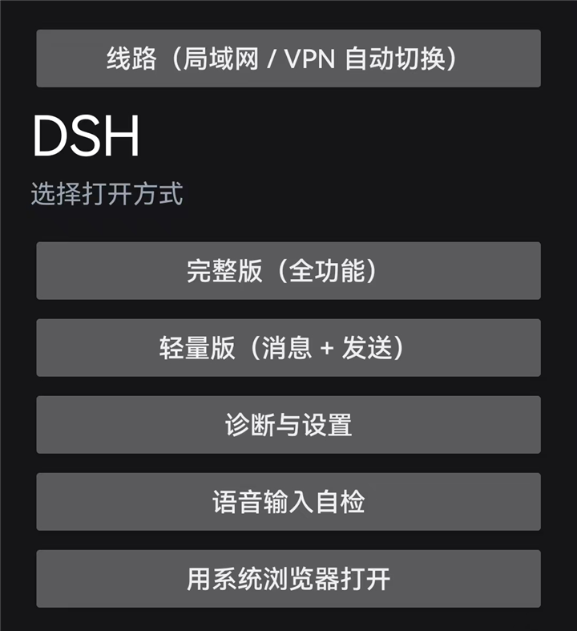

# dsh-mobile-proxy-agent

**让 DeepSeek Harness（DSH）在"手机 + 慢链路"上真正可用。**

DSH 的网页端是给桌面浏览器写的。放到一台 手机（移动浏览器）上，通过**明文 HTTP + Tailscale/局域网**访问时，会连着踩一串坑。这个仓库把这些坑一条条堵上，并且**不重装 APK、不改 DSH 本体** —— 改一个 CSS/JS 文件刷新即生效。

纯 Python 3 标准库 + 少量前端脚本，无数据库、无外部服务依赖。已在手机（视口 360×780）实机验证。

> **当前版本 v0.2.1** · 作者 [@yuxiaole_awa](https://github.com/yuxiaole-bili) · 仓库 <https://github.com/yuxiaole-bili/dsh-mobile-proxy-agent>
>
> 本版做过一轮**安全性自查与真机攻防演练**：10 轮 CTF（夺旗）从 9/10 收敛到 **10/10 全拦**，
> 详见 [安全说明](#安全说明) 与 [docs/PENTEST.md](docs/PENTEST.md)。



> **English summary** — A toolkit that makes the DeepSeek Harness web UI usable on an old
> Android phone (手机 / 移动浏览器) over a plain-HTTP Tailscale/LAN link.
> Three layers: a **DSH plugin** (the proper way: polyfills/UI + helper endpoints), an optional
> **reverse proxy** (works with zero DSH-side change, and covers what a browser-side plugin
> cannot), and an optional **Android shell** (native bridges for voice recording and
> "open with a phone app", plus LAN/VPN auto-switching). Everything here is verified against a
> live install; see `MANIFEST.txt` and [docs/ARCHITECTURE.md](docs/ARCHITECTURE.md).

---

## 它解决的是什么问题

| 现象 | 根因 |
|---|---|
| 完整版**打不开**／白屏 | 较旧内核 没有 `Promise.withResolvers`、`AbortSignal.any` 等新 API |
| 手机点麦克风只弹"语音识别尚未就绪" | 明文 HTTP **不是安全上下文** → `navigator.mediaDevices` 压根不存在 |
| 页面挤、抽屉盖住正文、**按键重叠** | 桌面栅格 + 侧栏抽屉在 360 px 视口下的布局问题 |
| 会话列表一次几百 KB | `session/list` 全量返回 78 万字节 |
| 加载要好几秒 | 首屏 `session/page` 默认拉 500 条消息 |
| 打开文件变成"在电脑上打开" | DSH 把"打开文件"委派给 Host 侧用默认程序打开 |
| **发图片被吞** | 手机上行慢（实测 3 KB/s），代理边收边转发 → 撞上游 300 s 请求超时 → 408 |
| 在家也要绕服务器 | 手机上只有 Tailscale 地址，Wi-Fi 下不会走局域网直连 |
| 底部用量被截断成 `160…`、`2376…` | 状态行是固定网格列，文字被省略号砍掉 |
| "上下文洞察"面板**关不掉** | 该覆盖层自身没有任何关闭控件 |

## 功能

- **手机端反向代理**：默认监听 `0.0.0.0:19390`，转发到本机 DSH（`127.0.0.1:19387`）；带 capability key 鉴权、Cookie 会话、**大 body 先收完再转发**（修"发图片被吞"）
- **热补丁通道**：`proxy/hotpatch/*.css|js` **按请求实时读取**并注入手机页面（按文件名排序、每个文件独立 IIFE + try/catch）；改文件刷新即生效，**不碰 DSH 本体**
- **手机交互层**：消除按键重叠、底部用量**折叠按钮**、**长按展开**、**上下滑手势**、覆盖层**通用关闭 ✕**、设置页改**单列整页**
- **文件 API 与预览**：`/f` 读文件、`/d` 列目录、`/dl` 下载；点文件名在**自建预览层**里打开（图片 / PDF / 代码），带**自写语法高亮**（零外部依赖）—— 解决"点文件被第三方 App 抢走"
- **轻量版 `/m`**：极小页面，只做"发消息 + 收消息"，弱网/只想发消息时用
- **目录接口缓存**：`pluginManager/listBundles`(86 KB)、`pluginInventory/list`(88 KB)、`listPlugins`(70 KB) 等只读目录接口缓存 60 s，手机点控件不再每次走一遍中继
- **DSH 插件形态**：`plugin/` 是标准 DSH 插件（`dsh.bundle.patch` + 客户端半）；宿主半提供 `/mobile-kit/health`、`/mobile-kit/info`
- **不挑客户端**：Android APK（WebView 壳）、iOS Safari、桌面浏览器都能用；iOS 可"添加到主屏幕"当 App

## 三层架构

```
┌──────────────────────────── 手机 ────────────────────────────┐
│  Android 壳（android/）                                       │
│    · WebView + 预装资源 + 离线构建                             │
│    · 原生桥：录音(__DSHVoice)、用手机 App 打开文件(openwith)     │
│    · 线路：局域网 / VPN 双模探测 + 热切换                       │
└───────────────────────┬──────────────────────────────────────┘
                        │ http://<host>:19390
┌───────────────────────▼──────────────────────────────────────┐
│  反向代理（proxy/，可选）                                      │
│    · 鉴权 / polyfill / 移动端适配 CSS / 热补丁通道               │
│    · 会话列表瘦身、首屏分页、接口磁盘缓存、压缩、WS 中继           │
│    · 只读文件接口 /f /d /dl + 自建预览与高亮                     │
│    · 大 body 先收完再转发（修"发图片被吞"）                      │
└───────────────────────┬──────────────────────────────────────┘
                        │ 127.0.0.1:19387
┌───────────────────────▼──────────────────────────────────────┐
│  DSH 本体（+ plugin/：DSH 插件 dsh-mobile-kit）                │
│    · 用 DSH 原生插件机制做的事：见 docs/ARCHITECTURE.md 的对照表  │
└──────────────────────────────────────────────────────────────┘
```

**为什么要分三层**：DSH 插件跑在 DSH 自己的进程/页面里，改不了"WebView 没有 `mediaDevices`"这种宿主环境问题，也改不了"上游 300 秒超时"这种网络层问题；而反向代理改不了原生录音、Android Intent、线路切换。所以三层各管一段，**你可以只用其中一层或两层**：

| 你想要的 | 需要哪几层 |
|---|---|
| 手机能打开完整版、布局不挤、列表不卡 | 代理 +（或）插件 |
| 手机点麦克风能出字 | 代理 + **Android 壳**（原生录音桥） |
| 点文件用手机上的 App 打开 | **Android 壳** + 一条热补丁 |
| 家里直连、出门走 VPN | **Android 壳**（线路探测） |
| 发大图不被吞 | **代理**（大 body 先收后转） |
| 苹果用户（不装 APK） | 只要**代理**（浏览器直开，见 [docs/USE-IOS.md](docs/USE-IOS.md)） |

### 端口

| 端口 | 绑定 | 用途 |
|------|------|------|
| 19390 | `0.0.0.0` | 手机侧入口（代理）。**唯一需要暴露给局域网的端口** |
| 19387 | `127.0.0.1` | DSH 本体（上游），仅本机 |
| 19395 | `127.0.0.1` / `::1` | 服务重启隧道（实测从外部**不可达**） |

## 目录

```
establish/
├─ plugin/     DSH 插件 dsh-mobile-kit（首选方式）
│  ├─ package.json        dsh.bundle / dsh.client / compatibility
│  ├─ index.js            宿主半（webServer 路由）
│  ├─ client.js           客户端半（__ModuleLoader__.load）
│  └─ cordis.patch.yml    客户端注册入口
├─ proxy/      反向代理
│  ├─ proxy.py            主程序（鉴权 / 文件 API / API 缓存 / 热补丁注入）
│  ├─ forward_watch.py    看门狗（无窗口，掉线自动拉起）
│  ├─ restart_svc.cmd     服务重启通道
│  ├─ svc_tunnel.ps1      隧道脚本
│  ├─ mobile.html         轻量版页面（对应路由 /m）
│  └─ hotpatch/           热补丁（按文件名顺序拼接注入）
├─ android/    Android 壳源码（离线构建，不需要 Gradle）
├─ tools/      体检与验证脚本（协议验收 / 无头回归 / 日志审计 / 安全审计 / 10 轮 CTF）
├─ docs/       ARCHITECTURE · SETUP · PLUGIN · SECURITY · PENTEST · PUBLISH · USE-IOS
└─ MANIFEST.txt  文件清单（大小 + MD5）
```

## 文档

| 文档 | 内容 |
|---|---|
| [docs/SETUP.md](docs/SETUP.md) | 安装与配置（代理、密钥、开机自启、Tailscale） |
| [docs/ARCHITECTURE.md](docs/ARCHITECTURE.md) | 数据流、鉴权、缓存、热补丁注入细节、**插件对照表** |
| [docs/PLUGIN.md](docs/PLUGIN.md) | DSH 插件契约、开发与挂载方式 |
| [docs/USE-IOS.md](docs/USE-IOS.md) | **苹果用户**：网页版用法、添加到主屏幕、注意事项 |
| [docs/SECURITY.md](docs/SECURITY.md) | 凭据处理、脱敏规则、资源上限、自查方法 |
| [docs/PENTEST.md](docs/PENTEST.md) | 10 轮 CTF 记分牌、杀伤链、处置与残余风险 |
| [docs/PUBLISH.md](docs/PUBLISH.md) | 开源发布清单 |

## 快速开始

### 1. 起代理（零 DSH 改动）

```powershell
$env:DSH_LISTEN_HOST = "0.0.0.0"     # 默认就是 0.0.0.0
python proxy\proxy.py
```

首次运行生成 capability key（`cap.key`），并打印带 key 的完整链接。

### 2. 手机打开

```
http://<电脑IP>:19390/?k=<cap.key>
```

密钥写入 cookie 后，之后直接开 `http://<电脑IP>:19390/` 即可。

### 3. 弱网 / 只想发消息：轻量版

```
http://<电脑IP>:19390/m
```

### 4. 体检

```powershell
pwsh -File tools\healthcheck_mobile.ps1      # 进程 / 监听 / 协议 / 热补丁语法 / 体积 / 无头渲染
```

### 5. 可选：挂成 DSH 插件

在 profile 的 `cordis.patch.yml` 里加一行（按包名或绝对路径）：

```yaml
- insert:
    - id: mobile-kit
      name: 'dsh-mobile-kit'          # 或 'D:/path/to/plugin/index.js'
```

宿主半验证：`GET /mobile-kit/health` → `{"ok":true,"name":"mobile-kit",...}`

### 6. 可选：Android 壳

```powershell
D:\code\dsh-android\build.ps1     # 改脚本里的 $JDK/$SDK 路径；离线构建，不需要 Gradle/网络
```

## 手机端交互层

实测（360×780）逐项验证过的能力：

| 能力 | 用法 | 解决什么 |
|---|---|---|
| **消除按键重叠** | 自动 | 标题栏 chip 与右侧图标按钮**画在同一位置**（实测重叠 108 px） |
| **底部用量折叠** | 点 `⌄` / `⌃` | 状态行占地方；折叠状态存 localStorage |
| **长按展开** | 长按用量条 / 顶部 chip / 折叠的工具行 | 看完整数字、看全称、展开被折叠的内容 |
| **手势** | 用量条上滑=展开，下滑=收起 | 单手操作 |
| **覆盖层关闭 ✕** | 任何整屏覆盖层（如"上下文洞察"）出现时右上角自动挂 | 该覆盖层**自身没有任何关闭控件**，此前只能靠路由返回 |
| **设置页整页化** | 自动 | 原本两列被挤成竖排（内容列只剩 124 px）→ 现在单列整页、内容满宽 |
| **代码高亮** | 点代码文件 | 预览自带高亮（注释/字符串/数字/关键字/类型/函数/变量/标签） |
| **文件预览** | 点文件名 chip | 在自建预览层打开，不再被第三方 App 抢走 |

**开关**：`?no-hot=1` 关全部热补丁；`?no-uiux=1` 只关交互层；`?no-chipview=1` 只关 chip 拦截。

## 性能

实测（无头 Edge，360×780，移动 UA）：

| 项 | 实测 |
|---|---|
| 连点 10 次控件 | **0 长任务**，单次约 **4 ms**（瓶颈在网络往返，不是 JS） |
| 静置 12 秒 | **0 长任务** |
| 目录接口缓存 | `listBundles` 86 KB / `pluginInventory` 88 KB / `listPlugins` 70 KB 命中本地缓存 |
| 渲染优化 | `content-visibility:auto` + 去掉大面板模糊/厚阴影 + 过渡 0.08 s |
| 自身定时器 | 1.5 s → 4 s，且 `document.hidden` 时不做任何 DOM 扫描 |
| 75 秒 25 次操作 | 堆 +14.5 MB（含未回收垃圾）、注入元素**恒为 1 个**（不累积） |

> 注：小弹层（菜单 / popover）**保留**毛玻璃，只对大面板去模糊 —— 否则会把菜单变得几乎全透明。

## 已经实测过的（不是"应该能行"）

| 能力 | 证据 |
|---|---|
| 手机（较旧内核 内核）能打开完整版 | 无头 Edge 模拟"先删 `Promise.withResolvers`"→ 0 控制台错误 |
| 只读文件接口 | 54/54 协议验收（含 9 种越权路径全 403、MIME、`nosniff`、`no-store`） |
| "点开会话自动收抽屉" | 20/20 无头用例（含"点非会话行不误收"的反例） |
| 用手机 App 打开文件 | 原生 `openwith`：下载 → `content://` → 系统选择器；headless 验证 RPC 参数 |
| 局域网 / VPN 双模切换 | 三地址 `/__health` 全 200；App 侧并行探测取最快 |
| 发大图不再被吞 | 慢速上传 A/B：缓冲组 `clen==have` 完整，对照组被上游 408/重置 |
| 手机端交互层 | 16/16 无头回归（折叠按钮 / 长按 / 手势 / 无重叠 / 无报错） |
| 设置页单列整页 | 6/6 无头回归（面板满屏、内容列 304 px、最窄文字块 ≥137 px、无竖排） |
| 插件是"正确的 DSH 插件" | 与真实插件逐字段比对一致；按 npm 包 `import()` 不抛错；启动清单含 `immediately:true`；宿主半路由 200 |

## 安全说明

> ⚠️ **这套东西是给个人自用设计的**：代理只用**单一 capability key** 鉴权，**拿到 key 就等于拿到电脑上的命令执行权**（DSH 的 agent 工具能读写文件、执行命令）。**不要部署到公网**，只在可信局域网 / Tailscale 内使用。

| 项 | 内容 |
|---|---|
| 凭据 | key 不入库、不入日志（历史日志里的明文已脱敏为 `<REDACTED>`） |
| 地址脱敏 | 仓库内所有内网 / Tailscale 地址均为占位符（`<PC-LAN-IP>` 等） |
| 文件权限 | 代理目录（含 `cap.key`）ACL 断开继承，只留 SYSTEM / Administrators / 当前用户 |
| 客户端内存 | 错误数组上限 30 / 60 条，防长跑增长 |
| CI | `.github/workflows/secret-scan.yml` 每次 push 扫描密钥与真实地址 |

### 实机攻防验证（10 轮 CTF）

从**另一台主机**（外部视角）对代理做 10 轮非破坏性夺旗：

| 轮 | 攻击 | 结果 |
|---|---|---|
| R1 | 无密钥读 `/f`（工作区文件） | ✅ 403 |
| R2 | **带有效密钥**做 4 种目录穿越 | ✅ 全部拦下 |
| R3 | 无密钥读 `/__hot/patch.css`（JS 注入通道） | ✅ 403 |
| R4 | 向 `/__hot/*` 写入（PUT/POST/PATCH） | ✅ 无写入端点 |
| R5 | 无密钥目录列表 `/d` | ✅ 403 |
| R6 | **缓存越权**：密钥预热后用无密钥请求同一路径 | ✅ 403（鉴权在缓存查找之前） |
| R7 | 日志泄露（HTTP 可读 / 明文密钥） | ✅ 无路由、无明文 |
| R8 | 从外部连重启通道 19395 | ✅ 不可达 |
| R9 | SMB 445 对局域网暴露 | ⚠️ 第 1/2 轮被夺旗 → 修复后 ✅ 拦下 |
| R10 | 无密钥调用 `/api/*`（RCE 前置） | ✅ 全 403 |

**第 1/2 轮 9/10，修复后第 3 轮 10/10。** 唯一的洞在主机自身（不是本项目代码）：

```
445 可达 → 管理共享 C$/D$/E$ → 任一可用凭据 → 读 cap.key → 代理 → DSH → 主机命令执行
```

处置：`Block SMB on Public` 防火墙规则 + 移除多余共享 + 强口令。完整记录见 [docs/PENTEST.md](docs/PENTEST.md)。

## 界面预览

| 启动页（完整版 / 轻量版 / 诊断 / 语音自检） | 设置页（单列整页） |
|---|---|
|  |  |

> 截图来自实机（手机），已裁掉会话正文与服务器地址等个人信息。

> **界面语言**：手机端交互层（折叠按钮、文件预览、覆盖层关闭等）会**自动跟随 DSH 的语言**
> （读 `<html lang>`）；也可以强制指定：地址后加 `?lang=en` 或 `?lang=zh`（会记住选择）。

## 网页版（iPhone / iPad）

**不用装 APK**：手机浏览器直接打开代理地址就是完整版，交互层对 iOS Safari 同样生效。

- 完整版：`http://<电脑IP>:19390/?k=<访问密钥>`
- 轻量版（消息 + 发送，页面极小）：`http://<电脑IP>:19390/m`
- 添加到主屏幕即可当 App 用；详细步骤与 iOS 注意事项见 **[docs/USE-IOS.md](docs/USE-IOS.md)**

## 测试与验证

```powershell
# 体检（进程 / 监听 / 协议 / 热补丁语法 / 体积 / 无头渲染）
pwsh -File tools\healthcheck_mobile.ps1 -SkipHeadless

# 代理攻击面自查（免鉴权可达性、路径穿越、错误密钥、SSRF 面、监听面）
python tools\pentest_proxy.py

# 10 轮 CTF（自动种旗 → 攻击 → 记分 → 清理旗子）
python tools\ctf_10_rounds.py

# 泄露与资源审计（密钥 / 真实地址 / 缓存占用 / 进程内存）
python tools\security_audit.py
```

本版回归结果：交互层 **16/16 PASS**、设置页 **6/6 PASS**、CTF 第 3 轮 **10/10 全拦**、体检 **HEALTHY**。

## 路线图

- [x] **DSH 插件**（`plugin/`，官方 4 文件模板：`package.json` + `cordis.patch.yml` + `index.js` + `client.js`）
- [x] **热补丁通道**（改文件即生效，不重启 DSH）
- [x] **手机端交互层**（消重叠 / 折叠 / 长按 / 手势 / 覆盖层 ✕ / 设置页整页）
- [x] **苹果用户网页版**（浏览器直开 + 添加到主屏幕）
- [ ] 把"移动端适配全套 / 文件接口 / 分页 / 缓存 / 守夜人 / 手势"继续搬进插件（当前只搬了 polyfill + 两条布局修复）
- [ ] 插件化后出**零反向代理**模式
- [ ] Android 壳的线路探测改成"从插件拿候选地址"（而不是硬编码网段）
- [ ] 真机自动化冒烟（目前真机那一下点按仍需人手）

## 已知限制

- 电脑必须开着并运行代理（手机侧不做任何数据落地）
- 单密钥鉴权：无多用户、无审计、无限流；**key 泄露 = 主机命令执行权**，建议定期轮换、勿外发带 `?k=` 的链接
- 热补丁只注入**移动 UA**（`Android|iPhone|iPod|Mobile|HarmonyOS`）的页面；桌面 UA 不受影响
- 插件**宿主半**（`index.js`）改动需**重启 DSH** 才生效；**客户端半**（`client.js`）刷新页面即生效
- APK 是 WebView 壳（`android/` 为源码摘录，不含签名材料）
- iOS 用键盘自带听写，不走原生语音通道
- 设置页整页化、覆盖层 ✕ 等是针对**当前 DSH 版本的类名**做的适配，DSH 升级后可能需要同步

---

## English

**dsh-mobile-proxy-agent** makes DeepSeek Harness (DSH) usable on a phone. It is a small
reverse proxy plus a hot-patch channel: no DSH modification, no APK reinstall — edit a
CSS/JS file and the phone picks it up on refresh.

### What it gives you

- **Mobile reverse proxy** (`proxy/proxy.py`, default `0.0.0.0:19390`): capability-key auth,
  file API (`/f` `/d` `/dl`), API caching, and injection of the hot-patch channel
- **Hot-patch channel** (`proxy/hotpatch/`): CSS/JS re-read per request — change a file, refresh, done
- **Mobile UI layer**: removes overlapping buttons, adds a usage-collapse button, long-press
  to expand, swipe gestures, a generic overlay close button, and a full-screen settings page
- **File preview with syntax highlighting**: tapping a file chip opens it inside the app
  (images / PDF / code) instead of handing it to a third-party app
- **Lite version** at `/m` (message + send only) for slow links
- **Works with any client**: Android WebView shell, iOS Safari, desktop browsers

### Quick start

```bash
python proxy/proxy.py                              # on the machine running DSH
# then open on the phone:
#   http://<PC-IP>:19390/?k=<cap.key>              full version
#   http://<PC-IP>:19390/m                         lite version
```

iPhone / iPad: just open the URL in Safari and use *Add to Home Screen*; no APK needed.
See [docs/USE-IOS.md](docs/USE-IOS.md).

### Language

The mobile UI layer follows DSH's language automatically (`<html lang>`): switch DSH to
English and the injected buttons, file preview and settings shells follow.
You can also force it: append `?lang=en` (or `?lang=zh`) — the choice is remembered.

### Security

> ⚠️ Single capability key only: **whoever holds the key can run commands on the machine**
> through DSH's agent tools. Do not expose it to the public internet — keep it on a trusted
> LAN or inside Tailscale. See [docs/SECURITY.md](docs/SECURITY.md) and the 10-round CTF
> record in [docs/PENTEST.md](docs/PENTEST.md).

### Docs

[SETUP](docs/SETUP.md) · [ARCHITECTURE](docs/ARCHITECTURE.md) · [PLUGIN](docs/PLUGIN.md) ·
[SECURITY](docs/SECURITY.md) · [PENTEST](docs/PENTEST.md) · [PUBLISH](docs/PUBLISH.md) ·
[USE-IOS](docs/USE-IOS.md)

MIT © 2026 [yuxiaole_awa](https://github.com/yuxiaole-bili)

## 许可

MIT © 2026 [yuxiaole_awa](https://github.com/yuxiaole-bili) · 见 [`LICENSE`](LICENSE)

> 注意：本仓库**不含任何凭据**。访问密钥（`cap.key`）、服务令牌、私钥都是运行时文件，已被 `.gitignore` 排除；`android/` 里的 `DEFAULT_HOST`/`DEFAULT_KEY` 是占位符，首次启动请在 App 的「服务器设置」里填自己的地址与密钥。
